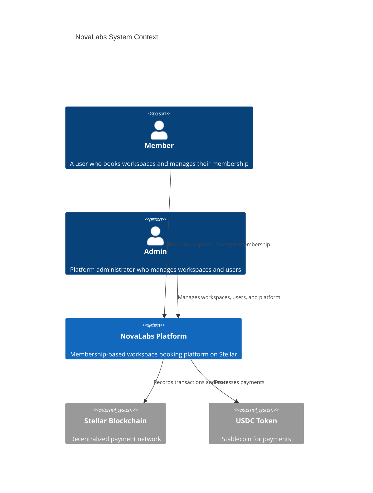
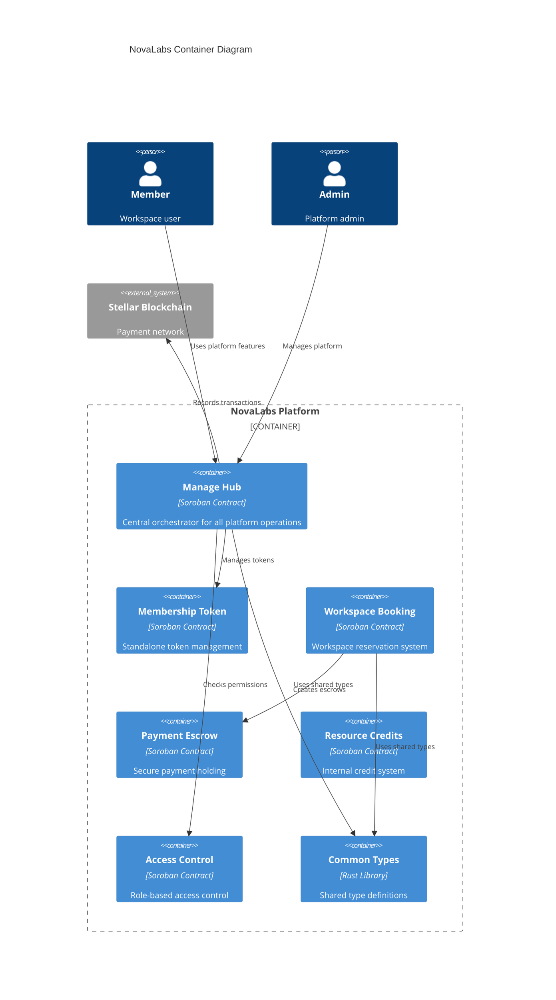

# NovaLabs System Architecture

## Overview

NovaLabs is a membership-based platform built on the Stellar blockchain using Soroban smart contracts. The system manages workspace bookings, membership tokens, payment escrows, and resource credits.

## C4 System Context Diagram



## C4 Container Diagram



## C4 Component Diagram (Manage Hub)

```mermaid
C4Component
    title Manage Hub Components

    Container_Ext(access_control, "Access Control", "RBAC system")
    Container_Ext(membership_token, "Membership Token", "Token contract")
    Container_Ext(common_types, "Common Types", "Shared library")

    Component_Boundary(hub, "Manage Hub Contract") {
        Component(token_ops, "Token Operations", "issue, transfer, get", "Core token management")
        Component(subscription_ops, "Subscription Operations", "create, renew, cancel", "Subscription lifecycle")
        Component(tier_ops, "Tier Operations", "create, update, get", "Tier management")
        Component(attendance_ops, "Attendance Operations", "log, get, analyze", "Attendance tracking")
        Component(staking_ops, "Staking Operations", "stake, unstake, config", "Token staking")
        Component(emergency_ops, "Emergency Operations", "pause, unpause", "Security controls")
    }

    Rel(token_ops, access_control, "Checks permissions")
    Rel(token_ops, membership_token, "Mints tokens")
    Rel(subscription_ops, tier_ops, "Uses tier config")
    Rel(attendance_ops, common_types, "Uses types")
```

## Key Components

### Smart Contracts

| Contract | Purpose | Key Functions |
|----------|---------|---------------|
| **Manage Hub** | Central orchestrator | Token ops, subscriptions, tiers, attendance |
| **Membership Token** | Token management | Issue, transfer, get |
| **Workspace Booking** | Reservation system | Book, cancel, check availability |
| **Payment Escrow** | Secure payments | Create, release, refund, dispute |
| **Resource Credits** | Internal currency | Mint, transfer, spend |
| **Access Control** | RBAC | Set role, check access, require access |

### Data Flow

1. **Member Registration**: Member → Manage Hub → Access Control → Membership Token
2. **Workspace Booking**: Member → Workspace Booking → Payment Escrow → USDC
3. **Attendance Logging**: Member → Manage Hub → Attendance Storage
4. **Subscription Management**: Member → Manage Hub → Tier Config → Subscription Storage

## Security Model

- **Role-Based Access Control**: Admin > Member > Guest hierarchy
- **Reentrancy Guards**: All fund-moving operations protected
- **Multisig Support**: Critical operations require multi-party approval
- **Emergency Pause**: Contract-wide pause for security incidents

## Deployment

Contracts are deployed on the Stellar blockchain using the Stellar CLI:

```bash
# Build contracts
cd contracts
stellar contract build

# Deploy to testnet
stellar contract deploy \
  --wasm target/wasm32v1-none/release/manage_hub.wasm \
  --source-account admin \
  --network testnet
```

## Testing

```bash
# Run all tests
cargo test --workspace

# Run specific contract tests
cargo test -p manage_hub
cargo test -p workspace_booking
cargo test -p payment_escrow
```
